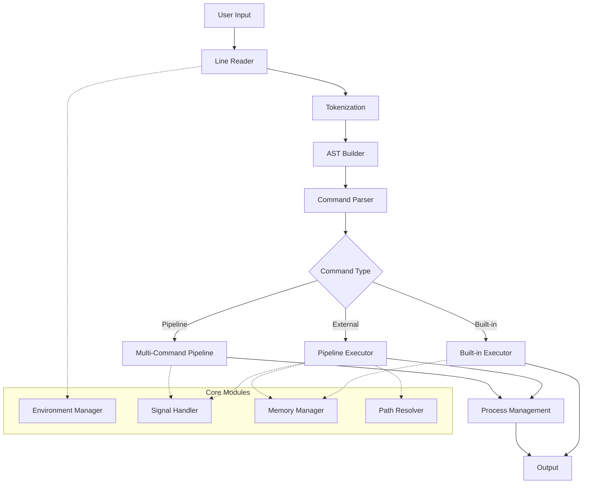

# 🚀 Minishell - A Bash-Like Shell Implementation

[](https://42.fr)
[](https://github.com/42School/norminette)
[](https://en.wikipedia.org/wiki/C99)
[](LICENSE)

A fully functional Unix shell implementation written in C, built as part of the 42 School curriculum. This project recreates essential bash functionality including command execution, pipelines, redirections, built-in commands, and advanced features like heredocs and environment variable expansion.

## 📑 Table of Contents

- [Features](#-features)
- [Architecture](#-architecture)
- [Installation](#-installation)
- [Usage](#-usage)
- [Project Structure](#-project-structure)
- [Implementation Details](#-implementation-details)
- [Testing](#-testing)
- [Evaluation Guide](#-evaluation-guide)
- [Technical Specifications](#-technical-specifications)
- [Acknowledgments](#-acknowledgments)

## ✨ Features

### Core Shell Functionality
- **Interactive Command Line**: Readline integration with history support
- **Command Execution**: External command execution with PATH resolution
- **Pipeline Support**: Multi-command pipelines with proper process management
- **I/O Redirections**: Input/output redirection (`<`, `>`, `>>`)
- **Heredocs**: Here-document support (`<<`) with delimiter handling
- **Environment Variables**: Variable expansion and manipulation
- **Signal Handling**: Proper handling of `Ctrl+C`, `Ctrl+D`, and `Ctrl+\`

### Built-in Commands
- `echo` - Display text with `-n` option support
- `cd` - Change directory with relative/absolute paths
- `pwd` - Print working directory
- `export` - Set environment variables
- `unset` - Remove environment variables
- `env` - Display environment variables
- `exit` - Exit shell with optional exit code

### Advanced Features
- **Syntax Error Detection**: Early detection of unmatched quotes and syntax errors
- **Process Management**: Proper parent/child process handling
- **Exit Code Handling**: Accurate exit codes (126 for permission denied, 127 for command not found)
- **Memory Management**: Comprehensive cleanup and leak prevention
- **AST Parsing**: Abstract Syntax Tree for complex command parsing

## 🏗️ Architecture



### Component Overview

| Component | Purpose | Key Files |
|-----------|---------|-----------|
| **Parsing** | Input processing, tokenization, AST building | `parsing/` directory |
| **Execution** | Command execution, process management | `execution/` directory |
| **Built-ins** | Shell built-in command implementations | `builtins/` directory |
| **Environment** | Variable management and expansion | `env_utils/` directory |
| **Memory** | Cleanup and memory management | `cleanup.c` |
| **Signals** | Signal handling and process control | `signals.c` |

## 🛠️ Installation

### Prerequisites
- GCC compiler
- GNU Readline library
- Make build system
- Linux/Unix environment

### Build Instructions

```bash
# Clone the repository
git clone https://github.com/liyassin/final_minishell.git
cd final_minishell

# Build the project
make

# Run the shell
./minishell
```

### Build Targets
```bash
make          # Build the project
make clean    # Remove object files
make fclean   # Remove all build artifacts
make re       # Rebuild from scratch
```

## 🚀 Usage

### Basic Commands
```bash
$ ./minishell
minishell$ echo "Hello, World!"
Hello, World!

minishell$ pwd
/home/user/minishell

minishell$ ls -la | grep minishell
-rwxr-xr-x 1 user user 45232 Aug 28 10:30 minishell
```

### Advanced Usage

#### Environment Variables
```bash
minishell$ export MY_VAR="Hello"
minishell$ echo $MY_VAR
Hello
minishell$ env | grep MY_VAR
MY_VAR=Hello
```

#### Redirections and Pipes
```bash
# Output redirection
minishell$ echo "test" > output.txt
minishell$ cat output.txt
test

# Input redirection
minishell$ cat < output.txt
test

# Pipeline
minishell$ cat file.txt | grep "pattern" | wc -l
42
```

#### Heredocs
```bash
minishell$ cat << EOF
> This is a
> multi-line
> heredoc
> EOF
This is a
multi-line
heredoc
```

## 📁 Project Structure

```
final_minishell/
├── 📁 builtins/           # Built-in command implementations
│   ├── cd.c               # Change directory command
│   ├── echo.c             # Echo command with -n support
│   ├── exit.c             # Exit command
│   ├── export.c           # Export environment variables
│   └── ...
├── 📁 env_utils/          # Environment variable utilities
│   ├── env_array.c        # Environment array management
│   ├── env_expand_build.c # Variable expansion building
│   └── ...
├── 📁 execution/          # Command execution engine
│   ├── main.c             # Main program entry
│   ├── executor.c         # Main execution logic
│   ├── pipeline_executor.c # Pipeline handling
│   └── ...
├── 📁 includes/           # Header files
│   ├── minishell.h        # Main header
│   ├── builtins.h         # Built-in declarations
│   └── ...
├── 📁 libft/              # Custom C library
├── 📁 parsing/            # Input parsing and AST building
│   ├── line_reader.c      # Interactive input handling
│   ├── ast_builder.c      # Abstract Syntax Tree construction
│   ├── tokenization.c     # Command tokenization
│   └── ...
├── Makefile               # Build configuration
└── README.md              # This file
```

## 🔧 Implementation Details

### Parsing Engine

The parsing system follows a multi-stage approach:

1. **Line Reading**: Interactive input with readline integration
2. **Tokenization**: Breaking input into logical tokens
3. **Quote Handling**: Processing single and double quotes
4. **Variable Expansion**: Expanding environment variables
5. **AST Construction**: Building an Abstract Syntax Tree

```c
// Example of the parsing flow
char *line = readline("minishell$ ");
if (has_syntax_errors(line))
    return (syntax_error(line));
    
t_token *tokens = tokenize(line);
t_ast *ast = build_ast(tokens);
execute_ast(ast);
```

### Execution Engine

The execution engine handles different command types:

- **Simple Commands**: Single command execution
- **Pipelines**: Multi-command chains with pipes
- **Built-ins**: Internal shell commands
- **Redirections**: File I/O redirection

### Memory Management

Comprehensive memory management ensures no leaks:

```c
// Cleanup strategy
void cleanup_shell(t_shell *shell)
{
    cleanup_env(shell->env);
    cleanup_ast(shell->ast);
    cleanup_history();
    free_all_allocations();
}
```

### Error Handling

Proper error codes and messages:
- **126**: Permission denied
- **127**: Command not found
- **130**: Interrupted by signal
- **2**: Syntax error

## 🧪 Testing

### Manual Testing
```bash
# Test basic commands
echo "test"
pwd
cd /tmp && pwd

# Test pipelines
ls | wc -l
cat file.txt | grep pattern | head -5

# Test redirections
echo "hello" > test.txt
cat < test.txt
ls >> output.log

# Test error cases
./nonexistent_command
echo "unterminated quote
```

### Edge Cases
- Empty input
- Unmatched quotes
- Invalid redirections
- Permission denied scenarios
- Signal interruptions

## 📋 Evaluation Guide

### Key Evaluation Points

#### 1. **Core Functionality** ✅
- [ ] Interactive prompt display
- [ ] Command execution works correctly
- [ ] Pipelines function properly
- [ ] Redirections work as expected
- [ ] Built-ins implement correctly

#### 2. **Error Handling** ✅
- [ ] Syntax errors detected early
- [ ] Proper exit codes (126, 127, etc.)
- [ ] Signal handling works correctly
- [ ] Memory leaks prevented

#### 3. **Advanced Features** ✅
- [ ] Environment variable expansion
- [ ] Heredoc implementation
- [ ] Quote processing (single/double)
- [ ] Complex command chains

### Demo Commands for Evaluation

```bash
# Basic functionality
echo "Hello World"
pwd
cd ~ && pwd

# Pipelines and redirections
ls -la | grep minishell
echo "test" > file.txt && cat file.txt

# Built-ins
export TEST="value" && echo $TEST
env | grep TEST
unset TEST && echo $TEST

# Error handling
./nonexistent
echo "unclosed quote
cat << EOF
test heredoc
EOF

# Advanced features
echo '$USER is in $(pwd)' | cat -e
```

### Evaluation Q&A

<details>
<summary><b>Q: How does your shell handle pipes?</b></summary>

**A**: Our shell creates a pipeline by:
1. Parsing the pipe-separated commands into an AST
2. Creating pipes using `pipe()` system call
3. Forking processes for each command
4. Setting up file descriptors to connect stdout→stdin
5. Executing commands in parallel
6. Waiting for all processes to complete

```c
// Simplified pipeline execution
for (int i = 0; i < cmd_count; i++) {
    if (i < cmd_count - 1) pipe(pipefd);
    pid = fork();
    if (pid == 0) {
        setup_pipe_fds(i, pipefd, prev_pipe);
        execve(cmd[i].path, cmd[i].args, env);
    }
    prev_pipe = pipefd[0];
}
```
</details>

<details>
<summary><b>Q: How do you handle environment variables?</b></summary>

**A**: Environment variables are managed through:
1. **Storage**: Maintaining a dynamic environment array
2. **Expansion**: Parsing `$VAR` and `${VAR}` syntax
3. **Built-ins**: `export`, `unset`, `env` commands
4. **Inheritance**: Passing environment to child processes

```c
// Variable expansion example
char *expand_variables(char *str, char **env)
{
    // Find $VAR patterns
    // Look up in environment
    // Replace with value
    // Handle special variables like $? $$ $0
}
```
</details>

<details>
<summary><b>Q: How do you ensure memory management?</b></summary>

**A**: Memory management strategy:
1. **Allocation tracking**: Every malloc has corresponding free
2. **Cleanup functions**: Systematic cleanup for each module
3. **Error handling**: Cleanup on error paths
4. **Signal safety**: Cleanup on signal interruption
5. **Valgrind testing**: No memory leaks in final build
</details>

## ⚙️ Technical Specifications

### Compliance
- **42 Norm**: Fully norminette compliant
- **Function Limits**: Maximum 5 functions per file
- **Line Limits**: Maximum 25 lines per function
- **Standards**: C99 standard compliance

### Dependencies
- **GNU Readline**: For interactive input
- **libft**: Custom C library
- **Standard Libraries**: POSIX-compliant system calls

### Performance
- **Memory Usage**: Optimized for minimal memory footprint
- **Process Management**: Efficient fork/exec handling
- **I/O Operations**: Buffered I/O for performance

### Security
- **Input Validation**: All user input validated
- **Buffer Safety**: No buffer overflows
- **Path Security**: Secure path resolution
- **Environment Safety**: Safe environment handling

## 🎯 Implementation Journey

### Phase 1: Foundation
- ✅ Basic readline integration
- ✅ Simple command execution
- ✅ Process management setup

### Phase 2: Core Features
- ✅ Pipeline implementation
- ✅ I/O redirection
- ✅ Built-in commands
- ✅ Environment variables

### Phase 3: Advanced Features
- ✅ Heredoc implementation
- ✅ Quote processing
- ✅ Signal handling
- ✅ Error management

### Phase 4: Polish & Compliance
- ✅ Norminette compliance
- ✅ Memory leak fixes
- ✅ Edge case handling
- ✅ Documentation

## 🤝 Acknowledgments

- **42 School**: For the project specification and learning environment
- **GNU Readline**: For the powerful line editing capabilities
- **Unix/Linux**: For the rich system call interface
- **The C Programming Language**: Foundation of systems programming

## 📝 License

This project is part of the 42 School curriculum. Please respect the academic integrity policies of your institution.

---

**Made with ❤️ by [anassih](https://github.com/liyassin) at 42 School**

*Ready for evaluation! 🚀*
